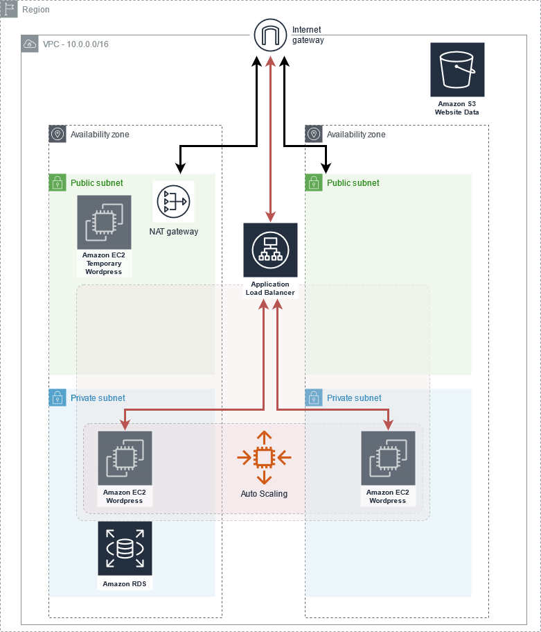

# GlacierToEat
Setting a wordpress website on AWS

>Your company, an ice-cream manufacturer called `Glacier To Eat`, is very proud of their cloud
journey. They want to share all the benefits and challenges they had in a developers blog. This
blog will also be used to increase the publicity of “Glacier To Eat” as an IT-focused employer
and to impress talents

_Your task is to deploy and manage this blog_ 

Because your team leader expects that there will
be a huge demand for that blog content, he asks you to consider the following requirements:
1. The webserver has to be decoupled from the database, to increase scalability.
2. The webserver has to be autoscaling, to meet the expected high demand.
3. Due to the rightsizing principle, we choose a small instance type (t2.micro, t3.micro) for our instances.
4. We use an S3 Bucket to store the website data
5. We use an Application Load Balancer to spread the load of our application

