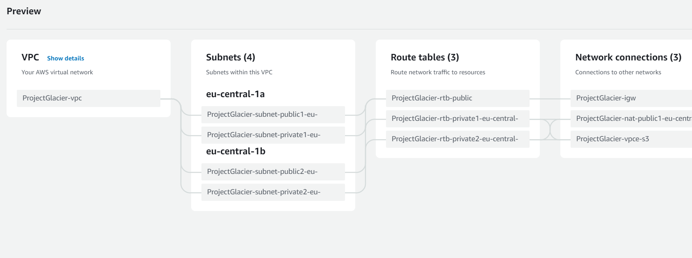

Create VPC architecture in AWS

Create RDS instance with MariaDB

Create EC2 Instance and install HTTPD, PHP7.4 and WORDPRESS

1. sudo yum install httpd 
2. 
3. sudo systemctl status httpd
4. 
5. sudo systemctl start  httpd
6. 
7. sudo systemctl status httpd
8. 
9. sudo yum install php7.4
10. 
11. sudo yum install php
12. 
13. sudo yum install php7
14. 

Create S3 Bucket
